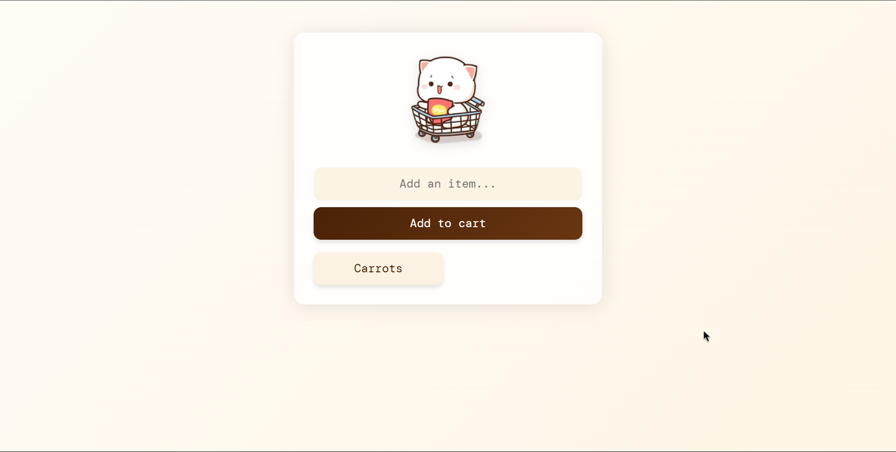
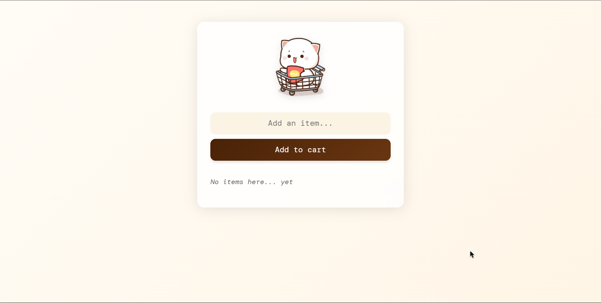

# Add To Cart

<div align="center">


A mobile-optimized shopping list application featuring real-time updates and cloud storage, designed to make your shopping experience seamless and organized.

[Features](#-features) • [Tech Stack](#-tech-stack) • [Installation](#-installation) • [Contributing](#-contributing) • [Screenshots](#-screenshots) • [Live](#-live) • [Author](#-author)

</div>

## Features

- **Mobile-First Design** - Optimized for smartphone use with responsive interface in larger screens.
- **Real-Time Updates** - Instantly sync your shopping list across devices
- **Cloud Storage** - Never lose your shopping list with Firebase backend
- **Simple Interface** - Add and remove items with minimal clicks
- **Tile-Based Layout** - Clear, easy-to-read item organization

## Tech Stack

### Frontend
- **[HTML5](https://developer.mozilla.org/en-US/docs/Web/HTML)** - Semantic markup structure
- **[CSS3](https://developer.mozilla.org/en-US/docs/Web/CSS)** - Responsive styling
- **[JavaScript](https://developer.mozilla.org/en-US/docs/Web/JavaScript)** - Dynamic functionality

### Backend
- **[Firebase](https://firebase.google.com/)** - Real-time database and cloud storage
  - Real-time data synchronization
  - Persistent data storage
  - Scalable infrastructure

## Installation

1. **Clone the repository**

   ```bash
   git clone https://github.com/your-username/add-to-cart.git
   cd add-to-cart
   ```

3. **Firebase Setup**
   - Create a new Firebase project at [Firebase Console](https://console.firebase.google.com/)
   - Navigate to Project Settings
   - Copy your Firebase configuration
   - In your a `index.js` file and add your configuration:

     ```javascript
     const appSettings = {
       databaseURL: //Add your database URL.
     };
     ```

4. **Launch the Application**
   - Open `index.html` with a local server
   - For example, using Python:

     ```bash
     python -m http.server 8000
     ```
   - Or using Live Server in VS Code

## Contributing 

We welcome contributions! Here's how you can help:

1. Fork the repository
2. Create a feature branch:

   ```bash
   git checkout -b feature/your-feature-name
   ```
3. Make your changes and commit them:

   ```bash
   git commit -m 'Add some feature'
   ```
4. Push to the branch:

   ```bash
   git push origin feature/your-feature-name
   ```
5. Open a Pull Request

## Screenshots

<div align="center">

### Main Interface


### Item Added To Cart


</div>

## Live

<div align="center">

[](https://add-to-a-shopping-list.netlify.app/)

</div>

---

<div align="center">
Made with ❤️ by Ashwin S Nambiar
</div>
